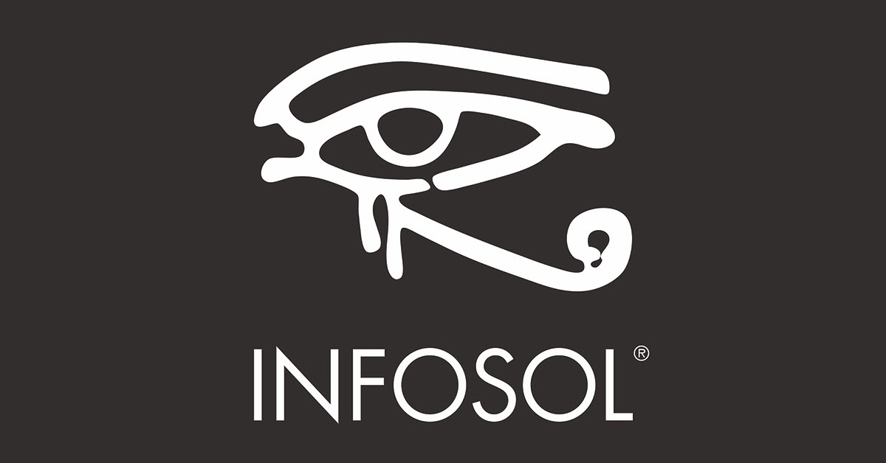

# InfoSol, Inc. | Seeing Beyond

**InfoSol** is a consulting and software company focused on **enterprise analytics**, helping organizations design, support, and modernize platforms built on **SAP BusinessObjects**, **Tableau**, and **Microsoft Power BI**.

## Consulting

InfoSol provides expert services to help organizations operate, modernize, and evolve their analytics environments, including:

- Consulting and support for SAP BusinessObjects, Tableau, and Power BI
- BI platform modernization, migration, and coexistence strategies
- Architecture, performance tuning, and security best practices
- Reporting automation and distribution design
- Governance and lifecycle management for enterprise BI platforms

Our consultants work with organizations ranging from long‑established on‑prem BI environments to modern, cloud‑based analytics stacks.

## Products

InfoSol publishes enterprise analytics software that extends and enhances leading BI platforms:

- **InfoBurst**  
  An enterprise reporting automation and distribution platform that integrates with analytics tools to deliver content securely, reliably, and at scale.  
  Learn more: https://ib.infosol.com/

- **Squirrel365**  
  A reporting, automation, and governance solution purpose‑built for Microsoft Power BI, helping organizations manage subscriptions, delivery, and oversight in production environments.  
  Learn more: https://www.squirrel365.io/

## Training & Community

InfoSol supports analytics professionals through education, collaboration, and community‑driven resources:

- **Speak BO**  
  A community and knowledge hub focused on SAP BusinessObjects best practices, tips, and real‑world solutions.  
  Learn more: https://speakbo.com/

- **Webi Like a Pro**  
  Advanced training and resources dedicated to SAP Web Intelligence (WebI) users, developers and administrators.  
  Learn more: https://webilikeapro.com/

- **IBIS Conference**  
  A community‑driven conference focused on enterprise analytics, bringing together practitioners, experts, and solution providers to share knowledge and best practices.  
  Learn more: https://attendibis.com/

## This GitHub Organization

This GitHub organization hosts tools, utilities, and examples that support:
- Enterprise BI administration and operations
- Analytics automation and integration workflows
- Lifecycle management for SAP BusinessObjects, Tableau, and Power BI
- Internal development and client‑facing accelerators

Some repositories are intended for InfoSol consultants and clients, while others may be useful to the broader analytics community.

## Learn More

- 🌐 InfoSol: https://www.infosol.com
